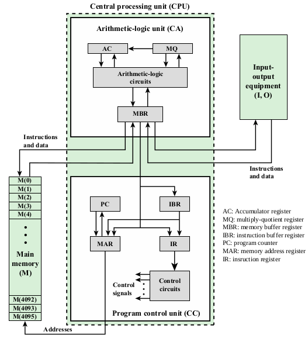
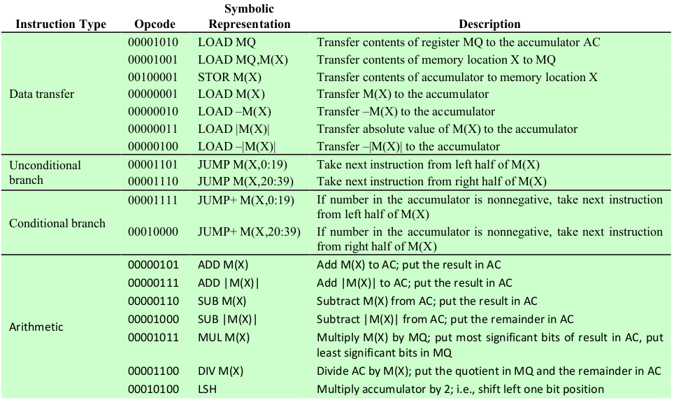
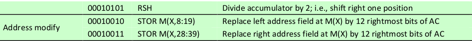
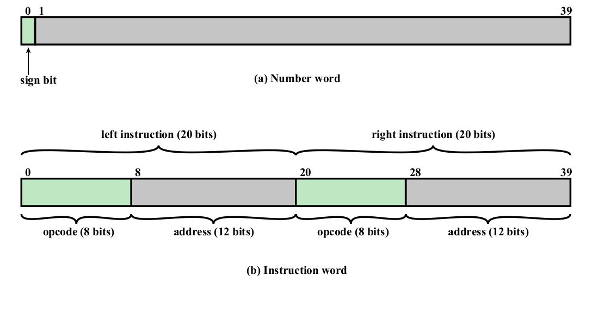

# IAS-Computer-Simulator
A program that is a simulator of the IAS architecture written in c (seen below) 

### Introduction
this project is a 20 bit CPU made with C, the IAS2 folder contains the project and unit_tests folder contains the unit tests for the functions
the project is already built , to rebuild the commands are :

cd ./IAS2
/opt/cmake/bin/cmake -S . -B ./build/ OR cmake -S . -B ./build/
cd ./build
make
./IAS

the program reads the binary instructions from binaire.txt and then interpets the instructions and executes them

the IAS instructions are below 

i started by creating 4096 slots of 40bit memory 

here is the IAS memory format 

(i believe that 4096 slots of memory is the max number of memory because we only have 
12 bits for MAR which means we can only adress 2^16=4096 slots of memory) 

i initalized all the slots of memory by putting 0s in all of the 40 bit word 
then i read the instructions from binaire.txt and put each line (40 bit word) into the ram
so if the binare.txt contained two lines we would find the first instruction in ram[0] 
and the second in ram[1] and the rest of 4094 ram would be filled with 0's 

### Functions to treat registers
i treated registers as a character array (each register had number same number of characters as it did bits but we must add one 
for the terminal character '\0' that marks the end of the string, for example the IR register was given 9 characters 8 characters
for the 8 bits that contain the opcode and one for the terminal character)

i used two main functions the first is binary_to_int() , this function takes an array and the number of characters (bits) on the array 
and it gives you the integer (for example if we give it binary_to_int('101',3) it will return 5)

i used another version which is binary_to_int2() which does the same thing except that it counts the first character as a sign bit
so if we do binary_to_int2('101',3) it will consider the '1' as a negative number and return -1

the second function is decimal_to_binary(), this function and integer and a bit number and it returns a character array of the binary 
representation of the integer we have given it 

i wrote 4 versions of this function because it had to take different paramaters (int then one for long long int then one for 
__int128_t)

the way i handled the registers is that i took the register (array of characters ) turned it into an integer, performed the required 
calculations (based on the instruction) then returned the the integer into the array of characters again 

the problem with this is that the INT TYPE in C is only 4 bytes long (32 bits) meanwhile we had 40 bit registers so that posed a problem
i fixed the problem by using long long ints which had 8 bytes of memory (64 bits)

## Fetching Cycle
for the fetching cycle i followed as closely possible this flowchart 

i specified more in the comments of the source code 

### Problem with multiplication
the problem with multiplication is that it takes 2 40 bits registers and the result is 80 bits longs 
even the long long int only contains 64 bits which is not enough so i found yet another type of int which is 
__int128_t, this type holds 128 bits of memory which is suffisient )

### Execution Cycle
i used a lookuptable or a dictionary to gather all of the opcodes that were listed in the project
(Le jeu d’instruction) then i used a function that looks at the opcode (which is a string) then it returns the id of the string 
i did this because in c you cant use a switch case with strings only with numbers 

the execution stops when the opcode in the IR does not correspond to any opcode that we listed in the lookup table 
